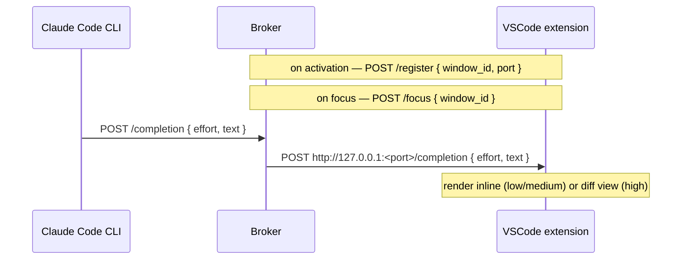

# Idea

## Motivation

LLM tokens are expensive. Running a coding agent like Claude Code fully
autonomously — in a loop with dynamic workflows — can burn up to **$6,000 in a
single night**. The agent generates and discards huge amounts of context and
output while you sleep.

[Code suggestions](https://docs.github.com/en/copilot/how-tos/get-code-suggestions/get-ide-code-suggestions)
(Copilot-style completions) are far cheaper. Instead of delegating the whole task
to an autonomous agent, **you stay the driver**: you write code, and when you
trigger a suggestion the agent produces a completion grounded in your current
context. You only pay for completions you actually pull.

## Concept

Instead of calling a hosted completion model, **whisperer reuses the Claude Code
CLI already running in your VSCode window** to gather context and do inference.

When triggered, Claude Code assembles a multi-layer context, reasons over it, and
produces a completion. It then pushes that completion to the broker via a plain
HTTP request. The broker forwards it over WebSocket to the correct VSCode window,
where it is rendered at the cursor.

### Effort levels

Completions are scoped by an `effort` argument:

```
/whisper [effort high|medium|low]
```

| Level | Scope | Default |
|-------|-------|---------|
| `low` | A few lines — finish the immediate expression or statement | |
| `medium` | A code block — function body, loop, condition branch | ✓ |
| `high` | The whole file — complete it from current state to done | |

### UX surface by effort

- **`low` / `medium`** — inline ghost text, grayed-out below the cursor. Tab to
  accept, Esc to dismiss. Works well up to ~30 lines.
- **`high`** — diff view. The completed file is shown side-by-side; Tab accepts
  the whole thing and writes it. Inline display breaks down at 200 lines, so the
  diff view is more honest about what you're accepting.

### Multi-layer context

Claude Code grounds each suggestion in:

- **Current position** — the cursor location and the symbol being edited
- **Inline context** — the surrounding lines in the active file
- **Related files** — nearby/imported files relevant to the edit
- **Previous actions** — recent git commits, the conversation/context window, edit history
- **Building intent** — the spec, the current plan, open TODOs

### Workflow

```
User types /whisper [effort] in Claude Code terminal
  -> Claude Code gathers context + infers at requested scope
  -> curl POST http://127.0.0.1:2323/completion { effort, text }
  -> broker looks up activeWindowId -> forwards to extension port
  -> extension renders inline (low/medium) or as diff view (high)
  -> Tab to accept  |  Esc to dismiss
```

## Architecture

Two things to build: the broker and the VSCode extension. Claude Code is the
user's existing session — no code ships there.

1. **VSCode extension** — on activation, registers itself with the broker
   (`POST /register { window_id, port }`). Sends a focus event (`POST /focus
   { window_id }`) whenever the window gains focus. Renders completions inline
   or as a diff view, and handles accept (Tab) / dismiss (Esc).

2. **Whisperer broker** — a small Bun HTTP server on port `2323`. Tracks which
   window is currently focused (`activeWindowId`) and a registry of
   `window_id → port`. When Claude Code posts a completion, broker forwards it
   to the right extension via a plain HTTP POST.

### Data flow



The broker is the only component that knows about all open windows — it holds
the registry of `window_id → port` and tracks the active window.
